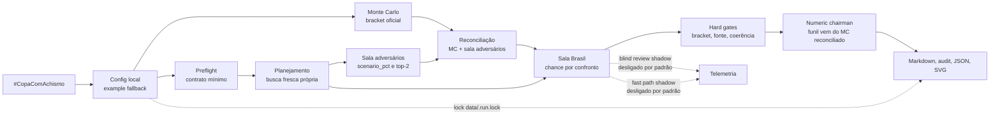
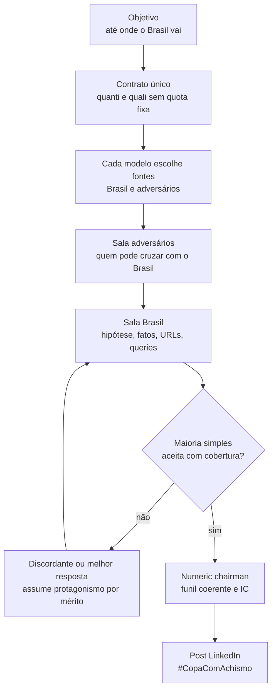

# World Cup 2026 Brazil Radar

Script agendável para gerar, a cada três dias, um post técnico de LinkedIn sobre até onde o Brasil pode ir na Copa do Mundo de 2026.

Hashtag oficial da série: `#CopaComAchismo`.

## Rodar agora

```bash
make doctor
make force
```

Use `make doctor` antes do run caro: ele testa quorum/fontes dos agentes sem renderizar post. Se passar, rode `make force` e acompanhe em outro terminal com:

```bash
make watch
```

Depois de um run completo, use:

```bash
make profile
make debate
```

`make profile` mostra onde o tempo foi gasto. `make debate` renderiza a conversa das salas sem chamar modelos de novo.

Saídas:

- `outputs/linkedin_brazil_YYYY-MM-DD.md`
- `outputs/audit_brazil_YYYY-MM-DD.md`
- `outputs/decision_flow_brazil_YYYY-MM-DD.svg`
- `outputs/linkedin_brazil_YYYY-MM-DD.json`
- `data/run_state.json`
- `data/watchdog.jsonl`

## Estado operacional atual

Este repo versiona `config/worldcup_brazil.example.json`. O `Makefile` aponta para `config/worldcup_brazil.json`, mas o loader cai automaticamente no exemplo quando esse arquivo local não existe. Para operação diária estável, copie o exemplo para `config/worldcup_brazil.json` quando quiser manter credenciais, knobs ou inputs locais fora do template versionado.

O caminho recomendado é via `make`, porque ele usa `uv run python` e os paths esperados pelo projeto. `python3 scripts/run_daily_worldcup_brazil.py --force` ainda funciona se o ambiente Python local já tiver as dependências corretas, mas não é o caminho operacional preferido.

Estado das features sensíveis:

- `numeric_chairman_enabled=true`: o funil publicado vem do Monte Carlo/bracket reconciliado; LLM não escolhe o número final livremente.
- `blind_peer_review_enabled=false`: revisão cega existe, mas fica desligada por padrão.
- `blind_peer_review_shadow_only=true`: quando ligada para telemetria, ela registra métricas sem alterar o consenso. Se você mudar para `false`, a revisão cega passa a gatear saídas por consenso.
- `llm_council_fast_path_enabled=false`: fast path está atrás de flag e desligado por padrão.
- `llm_council_fast_path_shadow_only=true`: quando testado, deve começar como shadow até haver evidência em `make profile`/watchdog.

Nota importante: a revisão cega atual é segura como telemetria e, quando explicitamente tirada do shadow, funciona como freio de qualidade: a sala só encerra se bater aceitação cega mínima e não exceder o limite de autopreferência configurado. Ela não substitui o debate deliberativo nem o Monte Carlo.

## Configuração

O script usa `config/worldcup_brazil.json` quando ele existe. Se esse arquivo ainda não existir, ele usa automaticamente `config/worldcup_brazil.example.json`, para evitar rodar com configuração vazia e placeholders.

Quando a chave concreta estiver definida, copie `config/worldcup_brazil.example.json` para `config/worldcup_brazil.json` e ajuste adversários, sedes e probabilidades-base.

APIs suportadas por variável de ambiente:

- `OPENAI_API_KEY` para o slot `GPT 5.5`
- `ANTHROPIC_API_KEY` para o slot `Opus 4.8`
- `PERPLEXITY_API_KEY` para o slot `Perplexity Pro`
- `DEEPSEEK_API_KEY` para o slot `DeepSeek V4 Pro`
- `GEMINI_API_KEY` para o slot `Gemini Pro`
- `THE_ODDS_API_KEY` para odds externas

Os nomes exatos dos modelos são configuráveis:

- `OPENAI_GPT_MODEL`
- `ANTHROPIC_OPUS_MODEL`
- `DEEPSEEK_V4_PRO_MODEL` (padrão: `deepseek-v4-pro`)
- `DEEPSEEK_BASE_URL` (padrão: `https://api.deepseek.com`)
- `PERPLEXITY_MODEL`
- `GEMINI_MODEL`

Para modelos sem API, configure `web_fetch_url` ou `browser_command` no bloco `agents` de `config/worldcup_brazil.json`.

- `web_fetch_url`: se a URL contiver `{prompt}`, o script fará `GET` substituindo o prompt codificado; caso contrário, fará `POST` JSON com `slot`, `model` e `prompt`.
- `browser_command`: comando local/automação autenticada que recebe o prompt. Se algum argumento contiver `{prompt}`, o prompt é substituído ali; se contiver `{prompt_json}`, o prompt é substituído como JSON string; se não contiver placeholder de prompt, o prompt vai pelo `stdin`.

Variáveis de bridge suportadas diretamente:

- `OPENAI_WEB_FETCH_URL` / `OPENAI_BROWSER_COMMAND`
- `OPENAI_CLI_COMMAND` / `CHATGPT_CLI_COMMAND` / `GPT_CLI_COMMAND`
- `OPENAI_REASONING_EFFORT`
- `OPENAI_PREFER_BRIDGE` / `OPENAI_PREFER_CLI`
- `CLAUDE_WEB_FETCH_URL` / `CLAUDE_BROWSER_COMMAND`
- `CLAUDE_CLI_COMMAND`
- `CLAUDE_CLI_MODEL` / `CLAUDE_CLI_EFFORT`
- `GEMINI_WEB_FETCH_URL` / `GEMINI_BROWSER_COMMAND`
- `GEMINI_CLI_COMMAND`
- `GEMINI_FALLBACK_MODELS` (padrão: `gemini-3.1-flash-lite`)
- `GEMINI_PREFER_BRIDGE` / `GEMINI_PREFER_CLI`

Isso permite usar uma automação de browser/webfetch/CLI quando a API não estiver disponível nos slots que aceitam bridge. Para Claude, o slot `Opus 4.8` é CLI-first: se o binário `claude` estiver no `PATH`, o script usa automaticamente `claude --print --verbose --output-format stream-json --model "$CLAUDE_CLI_MODEL" --effort "$CLAUDE_CLI_EFFORT" "{prompt}"` e extrai o `result` final do stream, mesmo que `ANTHROPIC_API_KEY` exista. Os defaults são `CLAUDE_CLI_MODEL=claude-opus-4-8` e `CLAUDE_CLI_EFFORT=high`, para manter régua comum com OpenAI `reasoning_effort=high` e Gemini `thinkingLevel=HIGH`. Para forçar API Anthropic, defina `CLAUDE_PREFER_BRIDGE=false` ou `prefer_bridge=false` no slot.

Para GPT 5.5, o caminho local primário agora é o CLI `openai` no shell:

```bash
openai responses create --model gpt-5.5 --input '"Responda apenas: funcionando"' --reasoning '{"effort":"high"}'
```

Se `OPENAI_BROWSER_COMMAND`, `OPENAI_CLI_COMMAND`, `CHATGPT_CLI_COMMAND` ou `GPT_CLI_COMMAND` estiverem definidos, eles continuam como override explícito. Sem override, o script tenta `openai responses create --model "$OPENAI_GPT_MODEL" --input "{prompt_json}" --reasoning '{"effort":"high"}'`; se essa bridge falhar, cai para `codex --search exec --ignore-user-config --ignore-rules --ephemeral -s read-only "{prompt}"` como fallback do slot GPT. Via API OpenAI e CLI OpenAI, o default é `OPENAI_REASONING_EFFORT=high`; para alterar a régua, exporte `OPENAI_REASONING_EFFORT` explicitamente.

Para Gemini, o modelo preferencial é `gemini-3.5-flash` no planejamento de fontes e `gemini-3.1-flash-lite` nas chamadas mais frequentes de sala/reparo, conforme `model_order_by_role` do config. Se o binário `gemini` estiver no `PATH`, o script prefere `gemini --skip-trust -p "{prompt}" --output-format text --approval-mode plan -m "$GEMINI_MODEL"`. Se o CLI falhar, tenta fallback de modelo; se a bridge não responder e `GEMINI_API_KEY` existir, tenta a API HTTP `generateContent`. A troca de versão só é indicada no output quando fallback realmente é usado. Se você quiser API HTTP como caminho primário, use `GEMINI_PREFER_BRIDGE=false`. Os bridges Codex e Gemini removem variáveis `CODEX_*` de runtime herdadas da orquestração, preservando `CODEX_HOME`, para abrir uma execução própria. Quando uma bridge existe, ela é preferida por padrão mesmo com chave de API. DeepSeek não tem slot browser/free: existe apenas `DeepSeek V4 Pro` via `DEEPSEEK_API_KEY` e API DeepSeek. Sem API e sem bridge em um slot que aceite bridge, o slot vira fallback local e o post mostra essa limitação.

O CLI carrega primeiro `.env` e depois `~/.zshrc`, sem sobrescrever variáveis já presentes no processo. Linhas simples como `export GEMINI_API_KEY='...'` são aceitas para que o Gemini funcione também quando a chave está no shell do macOS.

Resiliência de rede:

- `MODEL PREFLIGHT`: por padrão, o runner faz um teste curto de contrato de cada modelo no início do run e imprime no stdout método (`cli:*`, `api:*` ou `web_fetch`), modelo configurado, modelo runtime e identidade declarada. Com `model_preflight_contract_enabled=true`, o teste exige JSON estruturado com `title_pct`, `summary` e `source_urls/source_queries` permitidas pelo Modelo Principal; isso detecta cedo modelos que respondem "funcionando" mas não conseguem cumprir o formato mínimo do planejamento. Use `model_preflight_enabled=false` no config ou `--no-model-preflight` para pular esse passo.
- `model_preflight_timeout_seconds` controla o timeout de cada smoke test, padrão `180`.
- `agent_timeout_seconds` controla o timeout das chamadas reais de planejamento, perguntas e respostas dos modelos; o config de exemplo usa `240` porque essa etapa inclui busca fresca, JSON auditável e cobertura completa de grupo/mata-mata.
- Bridges locais/CLI, como `claude`, `openai`, `codex` e `gemini`, herdam `agent_timeout_seconds` nas chamadas reais. Se você precisar sobrescrever só o orçamento de CLI, use `BROWSER_COMMAND_TIMEOUT_SECONDS`; sem essa variável, não há teto oculto de 120s.
- `agent_reentry_probe_enabled` permite que um modelo removido por timeout/fallback seja testado de novo em paralelo e volte à sala quando trouxer fontes próprias verificáveis; `agent_reentry_probe_timeout_seconds` usa `180` por padrão.
- `HTTP_MAX_ATTEMPTS` controla tentativas para HTTP retentável, padrão `3`.
- `HTTP_BACKOFF_BASE_SECONDS` controla o primeiro backoff exponencial, padrão `1.0`.
- `HTTP_BACKOFF_MAX_SECONDS` limita o teto do backoff, padrão `12.0`.
- Status retentáveis: `408`, `425`, `429`, `500`, `502`, `503`, `504`.
- `AGENT_BULKHEAD_DEFAULT` limita chamadas simultâneas por provedor/chave de API, padrão `3`.
- `AGENT_BULKHEAD_OPENAI_COMPATIBLE`, `AGENT_BULKHEAD_OPENAI`, `AGENT_BULKHEAD_ANTHROPIC` e `AGENT_BULKHEAD_GOOGLE_GEMINI` permitem override por provedor.
- Quando a API do Gemini retorna `429` com mensagem de créditos pré-pagos esgotados (`prepayment credits are depleted`), o watchdog e os arquivos de diagnóstico exibem uma ação clara: comprar/prepagar créditos no AI Studio. Esse caso não é tratado como simples rate limit recuperável.
- O runner usa lock local em `data/.run.lock` para evitar dois `make force` concorrentes sobrescrevendo artefatos ou gastando chamadas duplicadas. Se outro run estiver ativo, o CLI imprime `skip: outro run ja esta em andamento`. Para testes ou execuções isoladas, use `--lock-file /caminho/isolado/.run.lock`.

O bloco `knockout_matches` aceita múltiplos cenários por fase. O renderer agrupa em `16 avos`, `Oitavas`, `Quartas`, `Semifinal` e `Final`, mantendo a mesma linguagem de probabilidade, intervalo de confiança, local e racional. Use `scenario_pct` para mostrar a chance daquele confronto específico acontecer; `brazil_pct` continua sendo a chance de o Brasil passar caso aquele confronto aconteça.

Os arquivos `config/groups.config.json` e `config/bracket.config.json` são o contrato canônico de grupos e cruzamentos oficiais. Antes do Monte Carlo completo, o pipeline já usa esses arquivos para derivar o caminho possível do Brasil pela posição configurada no grupo (`brazil_group`, `brazil_expected_group_position`) e anotar cada fase com `bracket_match_id`, slot do Brasil, slots adversários e candidatos permitidos. Exemplo: com Brasil em `1C`, o `16 avos` é `1C x 2F`; portanto os modelos podem debater Holanda, Japão, Suécia ou Tunísia como candidatos do slot `2F`, mas não Canadá ou Suíça nessa fase.

Na reunião, `scenario_probabilities` é a chance de aquele confronto acontecer, enquanto `match_probabilities` é a chance do Brasil passar/vencer caso o confronto aconteça. O moderador só valida o escopo do bracket: ele não escolhe o adversário por mérito, apenas rejeita país impossível para a fase.

## Monte Carlo de chave

O bloco `monte_carlo` ativa uma simulação local, determinística por `seed`, antes da sala dos modelos. Ela simula a Copa inteira em três camadas:

- fase de grupos para todos os grupos oficiais, não só o Brasil;
- melhores terceiros e preenchimento da chave oficial;
- mata-mata completo até campeão.

Isso corrige o erro conceitual de escolher adversário apenas por lista permitida. Se o Brasil estiver majoritariamente como `1C`, o adversário de `16 avos` vem do slot `2F`; então Holanda, Japão, Suécia e Tunísia são simulados no grupo F com o mesmo motor usado para o Brasil. A saída dos dois adversários mais prováveis passa a vir da frequência simulada, e não de um palpite solto.

Campos principais:

```json
"monte_carlo": {
  "enabled": true,
  "iterations": 40000,
  "seed": 26062026,
  "confidence_level": 0.99,
  "rating_uncertainty_enabled": true,
  "rating_uncertainty_outer_samples": 200,
  "rating_uncertainty_inner_iterations": 200,
  "configured_rating_sigma": 50.0,
  "prior_rating_sigma": 150.0,
  "default_draw_pct": 24.0,
  "rating_scale": 400.0,
  "team_ratings": {
    "Brasil": 1850,
    "Holanda": 1860
  }
}
```

Quando `team_ratings` não cobre uma seleção, o motor usa um prior fraco por posição no grupo e mostra a cobertura explícita de rating no post/watchdog. Isso evita fingir precisão. A simulação também calcula `path_uncertainty_pct`; quanto mais espalhada a distribuição de adversários, mais o IC pode abrir.

Quando `rating_uncertainty_enabled=true`, o Monte Carlo vira uma simulação de dois níveis: o loop externo sorteia cenários de rating e o loop interno simula torneios. No config padrão, `200 x 200 = 40.000` torneios. Seleções com rating explícito usam `configured_rating_sigma`; seleções em prior fraco usam `prior_rating_sigma`. O post passa a declarar o nível do IC (`confidence_level`, hoje 99%) e expõe a banda epistêmica, em vez de fingir que o erro amostral Wilson é toda a incerteza.

O Monte Carlo só vira hard gate do caminho quando passa pela régua de confiabilidade: `path_gate_min_iterations` e `path_gate_min_rating_coverage_pct`. Acima dessa régua, ele pode filtrar candidato que não aparece chegando à fase e, quando o caminho está concentrado, reduzir a largura do IC com `path_gate_max_ci_narrow_pct`. Abaixo dessa régua, ele não elimina candidato da sala: entra como prior fraco (`path_gate_unreliable_prior_weight`) e preserva ou amplia o IC para não fingir precisão.

O cálculo dos adversários não fica preso ao rating-base. O campo `team_context` e os sinais `team_context_signals` reportados pelos modelos permitem ajustar a força efetiva de qualquer seleção com as mesmas famílias de dados usadas para o Brasil: bets/prediction markets, ratings, Sofascore/performance, lesões/cortes/notícias recentes, amistosos recentes, arbitragem/VAR/cartões e imprensa especializada. O sinal só altera a simulação quando traz seleção, categoria, delta numérico (`rating_delta` ou `probability_delta_pct`), confiança e fonte/query auditável. Sem fonte ou sem delta, entra como ignorado no watchdog e não move a chave.

Para calibração empírica depois que houver jogos resolvidos, use:

```bash
make calibration CALIBRATION_INPUT=data/calibration_predictions.json
```

O arquivo deve ser uma lista JSON com `predicted_pct` e `outcome` binário. O validador reporta Brier score, log loss, ECE e um multiplicador recomendado para alargar IC quando a calibração observada fica abaixo do alvo.

Quando `parallel_opponent_debriefing_enabled=true`, o runner abre uma sala separada para adversários prováveis do mata-mata antes da sala principal do Brasil. Ela usa os mesmos modelos, regras de fonte e validação de bracket, mas foca em `scenario_probabilities` e `match_probabilities` dos candidatos oficiais de `16 avos`, `Oitavas`, `Quartas`, `Semifinal` e `Final`. O resultado é reconciliado com o Monte Carlo e injetado no JSON da sala principal; assim, se uma seleção não aparece chegando àquela fase em uma simulação confiável de caminho, ela não vira top-2 só por narrativa da sala. Se a simulação estiver fraca, a sala continua podendo escolher esse candidato com fonte auditável, e o IC reflete a incerteza. A sala principal continua decidindo a leitura final do Brasil, mas já debate com os adversários prováveis vindos da sala de cruzamento.

Exemplo de sinal manual:

```json
"team_context": {
  "Suécia": [
    {
      "category": "bets_prediction_markets",
      "rating_delta": 90,
      "confidence": 0.8,
      "source_url": "https://example.com/sweden-market",
      "rationale": "Mercado encurtou Suécia para avançar no grupo F."
    }
  ]
}
```

No fluxo diário, Monte Carlo não substitui a sala. Ele entra como insumo quantitativo auditável. Os modelos recebem o resumo, podem aceitar ou contestar com fontes melhores, e a reunião ainda decide o consenso final.

O bloco opcional `market_value_momentum` permite usar valorização de jogadores via Transfermarkt quando houver atualização curta ou quase em tempo real. Ele fica desativado por padrão para evitar dado inventado. Quando ativado, preencha valores antigos e novos em euros por seleção:

```json
"market_value_momentum": {
  "enabled": true,
  "source": "Transfermarkt",
  "max_shift_pct": 2.5,
  "eur_per_probability_point": 25000000,
  "percent_multiplier_cap": 0.75,
  "teams": {
    "Brasil": [
      {"player": "Jogador A", "old_value_eur": 50000000, "new_value_eur": 55000000},
      {"player": "Jogador B", "old_value_eur": 10000000, "new_value_eur": 13000000}
    ],
    "Marrocos": [
      {"player": "Jogador C", "old_value_eur": 20000000, "new_value_eur": 21000000}
    ]
  }
}
```

Regra de peso: o delta nominal em euros domina o percentual isolado. Um jogador que sobe de 50M para 55M pesa mais que outro que sobe de 10M para 13M, mesmo com percentual menor. O percentual entra como multiplicador limitado por `percent_multiplier_cap`; `max_shift_pct` limita o sinal antes do blend, então o efeito final continua contido dentro da camada contextual.

## Harness de eventos recentes

Use `recent_event_impacts` para transformar fatos recentes em entradas auditáveis do modelo. Esse bloco existe para casos como amistoso recente, corte/lesão, suspensão, performance individual, arbitragem ou evento equivalente de adversário. O campo `brazil_shift_pct` é sempre do ponto de vista do Brasil: positivo aumenta a chance do Brasil; negativo reduz. O campo `scenario_shift_pct` altera a chance daquele confronto/cenário acontecer. O evento só deve entrar com `source_url` ou `source_query` auditável.

Exemplo de payload para um cenário como “Brasil 2x1 Egito” e “corte do lateral direito Wesley”:

```json
"recent_event_impacts": [
  {
    "id": "brasil-egito-2-1-friendly",
    "date": "2026-06-06",
    "team": "Brasil",
    "category": "statistical",
    "summary": "Amistoso: Brasil 2x1 Egito",
    "source_url": "https://fonte-real-do-jogo.example",
    "brazil_shift_pct": 1.2,
    "scenario_shift_pct": 0.4,
    "confidence": 0.72
  },
  {
    "id": "wesley-right-back-cut",
    "date": "2026-06-07",
    "team": "Brasil",
    "category": "qualitative",
    "summary": "Corte do lateral direito Wesley",
    "source_url": "https://fonte-real-do-corte.example",
    "brazil_shift_pct": -1.0,
    "scenario_shift_pct": -0.3,
    "confidence": 0.78
  },
  {
    "id": "opponent-form-update",
    "date": "2026-06-07",
    "team": "Uruguai",
    "category": "qualitative",
    "summary": "Uruguai chega com alta de performance ofensiva",
    "source_url": "https://fonte-real-do-adversario.example",
    "brazil_shift_pct": -2.0,
    "scenario_shift_pct": 1.0,
    "confidence": 0.66
  }
]
```

O harness `tests/test_event_impact_harness.py` valida quatro coisas: o pacote de eventos entra no prompt comum distribuído aos modelos; eventos quantitativos e qualitativos movem a estimativa do Brasil; eventos do adversário movem simulações de mata-mata; e os eventos aparecem no racional com data, fonte e efeito em pontos percentuais. No watchdog, eventos ativos aparecem no step `recent_event_harness`.

Para a fase de grupos, use `group_name`, `group_summary`, `date`, `venue`, `brazil_pct` e `draw_pct`. O post renderiza no formato:

```text
GRUPO C — probabilidade de vitória do Brasil por jogo:
• 13/jun vs Marrocos (Nova Jersey): 59% V | 24% E | 17% D
→ Brasil em 1º: ~66% ...
```

## Agendamento diário com execução efetiva a cada três dias

O script pode ser chamado todo dia. Ele só gera novo post se passaram três dias desde o último run bem-sucedido, exceto com `--force`.

Exemplo de cron diário às 08:00:

```cron
0 8 * * * cd "/Users/marcus/Documents/World Cup 2026" && /usr/bin/make daily >> data/cron.log 2>&1
```

## Watchdog

O run escreve eventos em JSONL para você acompanhar o que está acontecendo:

```bash
tail -f "/Users/marcus/Documents/World Cup 2026/data/watchdog.jsonl"
```

Etapas registradas:

- `run`
- `load_config`
- `model_preflight`
- `slot_excluded`
- `agent_source_planning`
- `agent_source_quorum`
- `agent_source_self_heal`
- `recent_event_harness`
- `estimate_matches`
- `parallel_opponent_debriefing`
- `model_meeting`
- `blind_peer_review`
- `report_coherence`
- `render_post`
- `write_outputs`

Use `--quiet-watchdog` para manter o JSONL sem progresso no stderr, ou `--no-watchdog` para desligar.

O watchdog também grava a sala de chat dos modelos com `step=model_room`:

- `status=chat` para planejamento de fontes e troca de protagonismo.
- `status=question` para a pergunta do protagonista da rodada.
- `status=response` para a resposta de cada modelo, com `support_score`.
- `status=degraded_publish` quando a sala preserva o último consenso válido e evita derrubar o run por uma última rodada estéril no teto operacional.

O quórum mínimo operacional é de 3 modelos com plano de fontes próprio e verificável. Se a primeira rodada vier abaixo disso, a engine aciona `agent_source_self_heal`: apenas os agentes removidos são rechamados com um prompt de reparo operacional, exigindo JSON estrito e `source_urls` ou `source_queries` permitidas no Modelo Principal. O run só falha depois dessas tentativas, e nesse caso o evento `agent_source_quorum` mostra `ready_count`, `required_count`, agentes ativos, agentes removidos e motivo por agente.

Para diagnosticar sem renderizar o post inteiro:

```bash
make doctor
```

Isso grava `outputs/agent_source_harness_latest.json`. Exit code `0` significa quorum atingido; exit code `2` significa quorum ainda insuficiente após o diagnóstico.

### Controles de fluxo da sala

- `protagonist_timeout_seconds`: teto dedicado para a pergunta do protagonista (chamada sequencial que segura a rodada). Default: igual a `agent_timeout_seconds`; o config exemplo usa `210`, acima do p95 observado, para cortar só o caso patológico de protagonista travado sem derrubar pergunta legítima para fallback.
- `meeting_slot_breaker_threshold` (default 3): circuit breaker por validade estruturada. Um slot com N respostas consecutivas sem voto válido (`removed_from_main` ou fallback sem fonte auditável) sai das rodadas seguintes e só volta pelo probe assíncrono de reentrada com fontes próprias. Nunca derruba a sala abaixo de `meeting_min_participants`. Evento no watchdog: `circuit_breaker`.
- `meeting_stability_delta_pp` (default 1.0) e `meeting_stability_rounds` (default 2): encerramento antecipado por estabilidade. Após `meeting_min_rounds`, com cobertura completa e aceitação da maioria, se o título de consenso variar no máximo `delta` por N rodadas consecutivas, a sala fecha em vez de re-litigar até `meeting_max_rounds`. Evento no watchdog: `early_exit`.
- `meeting_sterile_round_limit` (default 2): N rodadas consecutivas sem nenhum voto válido abortam a sala com `MeetingConsensusError` (exit 1 no CLI), em vez de queimar rodadas até o teto e fabricar consenso de fallbacks. Consenso com peso total zero também é erro (`DegenerateConsensusError`), nunca média de baseline. Eventos: `sterile_round` e `model_meeting fail`.
- `meeting_max_reentries_per_slot` (default 1) e `agent_reentry_probe_max_attempts` (default 2): cooldown de reentrada. Slot readmitido que quebra o breaker de novo fica fora até o fim do run; o orçamento de probes evita sondagens repetidas caras (ex.: HTTP 429 em série). Vale para slots removidos pelo breaker e pelo planejamento. Eventos: `reentry_cooldown` e `reentry_probe_budget`.
- Elegibilidade do protagonista: quem teve voto inválido na rodada, ou 2 perguntas-fallback consecutivas como protagonista, perde o protagonismo para o melhor respondente válido. Evento: `protagonist_rotation`.

Funil de probabilidades: com Monte Carlo ativo, o funil publicado (quartas/semifinal/final/título) vem inteiro da simulação reconciliada — o título não é mais colado do consenso da sala. A leitura direta dos modelos aparece em "Palpites por modelo" e em `metadata.agent_title_consensus_pct`, e influencia o funil apenas via sinais de contexto auditáveis. O gate de coerência pré-render permanece como retaguarda.

- `allow_informed_agreement_votes` (default true): aceite explícito da tese do protagonista conta como voto/aceitação mesmo sem fonte própria, desde que referencie a tese, não discorde e não injete mapas de probabilidade novos sem fonte. A exigência de número+fonte continua valendo para a tese e para discordância/ajuste.
- Validador de bracket por proximidade e multi-caminho: menção de seleção só conta contra a fase do marcador mais próximo (janela de ~280 caracteres, com plurais), candidatos são a união dos caminhos do Brasil em 1º/2º do grupo, adversários de grupo e enumerações do universo configurado nunca são flagrados. A mensagem de remoção continua citando fase, seleção e candidatos permitidos.
- `exclude_slots_failing_preflight` (default true): slot que falha duro no preflight (ex.: HTTP 429 em toda a cadeia) sai do run inteiro — sem chamadas de planejamento nem probes de reentrada. Evento `slot_excluded` no watchdog. Com `--strict-agents` a exclusão não se aplica.
- `CLAUDE_CLI_ALLOWED_TOOLS` (default `WebSearch,WebFetch`): o bridge CLI do slot Opus concede ferramentas de busca via `--allowedTools`; string vazia desliga a flag.
- `repair_format_removals_with_quorum` (default true): respostas de planejamento em JSON parcial podem receber reparo curto de formato mesmo quando o quorum já foi atingido. O objetivo é recuperar uma quarta/quinta voz antes da sala abrir sem pagar probe longo no meio da reunião.
- `parallel_opponent_debriefing_enabled` (default true): abre sala separada para adversários prováveis do mata-mata. Ela tem contrato de rounds próprio e precisa sair com consenso para ser usada pelo fast path da sala principal.
- `blind_peer_review_enabled` (default false): revisão cega está implementada, mas desativada por padrão.
- `blind_peer_review_shadow_only` (default true): mantém a revisão como telemetria. Com `false`, ela bloqueia saída por consenso quando falta aceitação cega ou quando `self_preference_leakage` passa do limite.
- `blind_peer_review_acceptance_threshold` (default 0.72): score mínimo para uma posição anônima contar como aceita.
- `blind_peer_review_max_self_preference_leakage` (default 0.20): teto de autopreferência; acima disso, a saída por consenso é bloqueada e o watchdog registra `blind_peer_review blocked`.
- O contrato local da revisão cega roda em `make validate` via `scripts/validate_blind_peer_review_contract.py`: máscara de identidade, threshold de leakage e motivos de bloqueio são verificados sem chamar APIs.
- `llm_council_fast_path_enabled` (default false): fast path está implementado atrás de flag, mas desligado por padrão. Quando ligado, ainda precisa passar gates de quorum, cobertura, aceitação, baixa dispersão, sala paralela utilizável e coerência do relatório. Com `llm_council_fast_path_shadow_only=true`, ele só registra candidato e não encurta a sala.

Para ver o breakdown de tempo do último run (etapas, latência por rodada, fase de pergunta vs respostas, eventos de controle):

```bash
make profile
```

Para ler a conversa das duas salas em formato humano, sem rodar modelos de novo:

```bash
make debate
```

Esse comando lê o último `outputs/linkedin_brazil_YYYY-MM-DD.json` e imprime:

- a sala paralela de adversários do Brasil;
- a seção de retroalimentação, com top-2/reconciliação por fase;
- a sala principal Brasil recebendo esses cenários e debatendo até título.

Para salvar em arquivo:

```bash
make debate DEBATE_OUTPUT=outputs/debate_latest.md
```

Para escolher um run específico:

```bash
make debate DEBATE_INPUT=outputs/linkedin_brazil_2026-06-09.json
```

## Diagramas da engine

### Diagrama técnico



### Diagrama funcional



## Regra de decisão

- Cada modelo usa dados quantitativos e qualitativos conforme a força das fontes encontradas, sem receber ou declarar quota fixa entre quanti e quali, buscando uma hipótese auditável que os outros modelos consigam aceitar ou contestar.
- O lado quantitativo pode usar odds, prediction markets, ratings, rankings e modelos públicos.
- O lado qualitativo pode usar lesões, cortes, cartões, arbitragem/VAR, forma recente, Sofascore/performance individual, contexto de elenco e chaveamento.
- Transfermarkt pode entrar como sinal qualitativo/contextual de momentum de elenco quando houver valores antigos/novos auditáveis: o script conta jogadores valorizados, calcula delta nominal, aplica multiplicador percentual limitado e mostra os destaques no markdown.
- Pesquisa simétrica obrigatória: cada modelo deve buscar informação atualizada para Brasil e adversários/cenários configurados usando as mesmas famílias de fonte, para que a reunião compare forças reais e não apenas uma leitura interna do Brasil.
- Contrato único: todos os modelos recebem as mesmas regras, objetivo e escopo. O mediador não faz fetch externo, não escolhe fonte, não injeta evidência central e não usa cache.
- Bracket oficial obrigatório: os modelos definem os adversários prováveis dentro dos slots oficiais da fase; o mediador rejeita adversário impossível para o cruzamento e amplia o IC quando o adversário ainda é um conjunto amplo de candidatos oficiais.
- Cinco slots de agentes são configurados: `Opus 4.8`, `GPT 5.5`, `Perplexity Pro`, `DeepSeek V4 Pro`, `Gemini Pro`. Na execução real, slots podem ser excluídos no preflight por falha dura, quota, 429 ou falta de resposta auditável; a sala continua se o quorum mínimo for preservado.
- Rodada 0: cada modelo faz busca fresca própria, sem cache, escolhe fontes e queries dentro do direcionamento macro e reporta `source_urls`/`source_queries`.
- Rodadas de reunião: o protagonista faz uma pergunta, os demais respondem, a resposta mais aceita assume o protagonismo seguinte, e o ciclo continua. Não são "seis conversas"; são cinco participantes que podem falar várias vezes até a proposta ficar aceita pela maioria simples da sala.
- Por padrão, a sala exige `meeting_min_rounds=6`, `meeting_max_rounds=18`, `meeting_min_participants=3`, `meeting_require_peer_acceptance=true` e `meeting_require_full_path_coverage=true`. As 6 rodadas são apenas um piso anti-consenso prematuro; o encerramento real exige baixa dispersão, maioria simples dos participantes ativos, aceite dos pares suficientes para formar essa maioria e cobertura explícita de fase de grupos, 16 avos, oitavas, quartas, semifinal, final e chance de título. O máximo é só um teto de segurança operacional.
- A etapa anterior à sala usa `minimum_source_ready_agents=3`: se menos de 3 modelos trouxerem plano de fontes próprio/verificável, o debriefing principal não abre. Isso não significa que 3 modelos precisam concordar em todos os cenários; significa que a reunião precisa começar com diversidade mínima de evidência. Depois da abertura, o quórum de decisão vira `floor(participantes_ativos / 2) + 1`.
- Fallback conta quando é uma resposta auditável de um participante ativo. Fallback local sintético sem fonte, sem resposta utilizável ou sem plano verificável não vira voto: ele sai do pool ativo até uma reentrada assíncrona trazer fontes próprias.
- O post mostra palpites por modelo, resumo da sala, sequência de perguntas/respostas, troca de protagonismo, fontes, custos e influência percentual de cada modelo no consenso.
- A conversa completa da sala fica em `outputs/audit_brazil_YYYY-MM-DD.md`.
- O gráfico limpo do racional fica em `outputs/decision_flow_brazil_YYYY-MM-DD.svg` e aparece referenciado no markdown do post.
- Jogos e probabilidades finais carregam intervalo de confiança. A largura aumenta quando há dispersão entre modelos ou falhas de fonte/API.
- Se uma API falha e `--strict-agents` não foi usado, o run aplica fallback local conservador e escreve warning no post. Com `--strict-agents`, falhas de agente derrubam o run.
- Blind review e fast path existem para futura redução de latência/viés, mas permanecem desligados ou em shadow no config exemplo. Não trate essas flags como prontas para encurtar a sala principal sem medir antes com `make profile` e revisar o watchdog.
