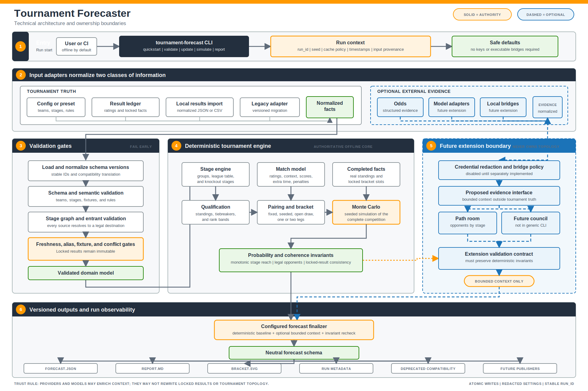

# Technical Architecture

- **Status:** Target architecture contract for the open-source migration
- **Product:** Tournament Forecaster

The architecture keeps tournament rules and probability computation deterministic and offline. Network providers, model providers, local executable bridges, and publishing templates are reserved adapter boundaries, not owners of tournament truth. The current generic CLI implements local normalized-file imports and does not implement model providers, command bridges, or publishing adapters.

## Component Architecture

The diagram is also available as a [PNG export](assets/architecture/technical-architecture.png). Solid paths carry authoritative tournament state. Dashed blue paths carry optional evidence; dashed orange paths carry structural constraints from the deterministic engine into the council.

## One Forecast Run

| Step | Owner | Action | Failure behavior |
| --- | --- | --- | --- |
| 1 | CLI | Create the `run_id`, seed, cache policy, timestamps, and input provenance | Invalid CLI or config arguments fail locally |
| 2 | Provider adapters, when enabled | Preview results or odds, redact settings, normalize external identifiers, and respect freshness policy | Expected unavailability follows `required`, `cached_with_ttl`, or `best_effort`; internal errors propagate |
| 3 | Offline validator | Validate schema, stage graph, entrants, aliases, freshness, fixtures, and result conflicts | Structural failures stop before simulation or paid calls |
| 4 | Result ledger | Load immutable completed facts and atomically accept reviewed final results | Conflicts never overwrite silently |
| 5 | Deterministic engine | Simulate all remaining matches and derive standings, qualification, pairings, stage reach, and title probability | Coherence violations invalidate the run |
| 6 | Optional council | Receive the baseline, legal opponents, evidence, and bounds; return bounded context or a degraded no-op | It cannot change completed results or tournament topology |
| 7 | Finalizer and reporters | Recheck invariants and atomically write versioned JSON, Markdown, SVG, audit, compatibility, and publishing artifacts | Partial output sets are not published as complete runs |

## Ownership Rules

| Concern | Owning component | Components that may not override it |
| --- | --- | --- |
| Completed match facts | validated result ledger | council, odds provider, publisher |
| Tournament topology | stage graph and pairing engine | council, result provider, templates |
| Standings and qualification | deterministic stage engine | council, renderer |
| Published probabilities | seeded simulation plus configured blend policy | individual model response |
| Contextual evidence | optional council and providers | deterministic core when council is disabled |
| Human presentation | report and publishing adapters | core domain model |

## Failure Behavior

- Invalid schemas, impossible stage references, stale required results, and result conflicts fail before simulation or paid model calls.
- Expected provider unavailability follows the configured `required`, `cached_with_ttl`, or `best_effort` policy; internal programming errors are never converted into provider downtime.
- Council failure degrades to the validated deterministic baseline. It never unlocks completed results, changes the stage graph, or invents legal opponents.
- Every accepted external fact records provider provenance and retrieval time. Every artifact records the `run_id`, input provenance, warnings, and compatibility conversions.
