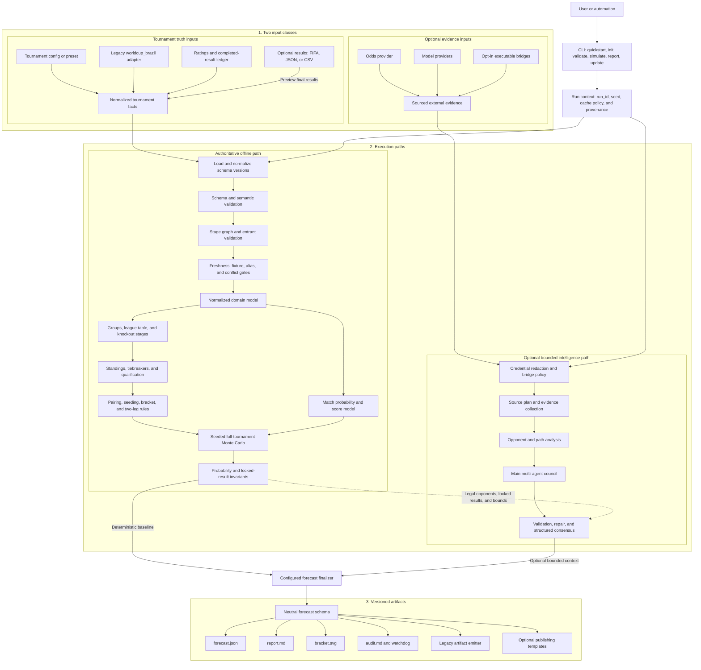
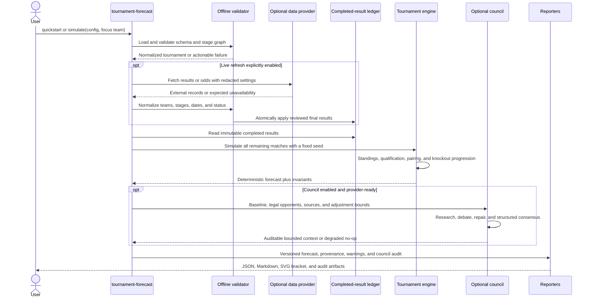

# Technical Architecture

- **Status:** Target architecture contract for the open-source migration
- **Product:** Tournament Forecaster

The architecture keeps tournament rules and probability computation deterministic and offline. Network providers, model providers, local executable bridges, and publishing templates are adapters around that core, not owners of tournament truth.

## Component Architecture

## One Forecast Run

## Ownership Rules

| Concern | Owning component | Components that may not override it |
| --- | --- | --- |
| Completed match facts | validated result ledger | council, odds provider, publisher |
| Tournament topology | stage graph and pairing engine | council, result provider, templates |
| Standings and qualification | deterministic stage engine | council, renderer |
| Published probabilities | seeded simulation plus configured blend policy | individual model response |
| Contextual evidence | optional council and providers | deterministic core when council is disabled |
| Human presentation | report and publishing adapters | core domain model |

## Failure Behavior

- Invalid schemas, impossible stage references, stale required results, and result conflicts fail before simulation or paid model calls.
- Expected provider unavailability follows the configured `required`, `cached_with_ttl`, or `best_effort` policy; internal programming errors are never converted into provider downtime.
- Council failure degrades to the validated deterministic baseline. It never unlocks completed results, changes the stage graph, or invents legal opponents.
- Every accepted external fact records provider provenance and retrieval time. Every artifact records the `run_id`, input provenance, warnings, and compatibility conversions.
