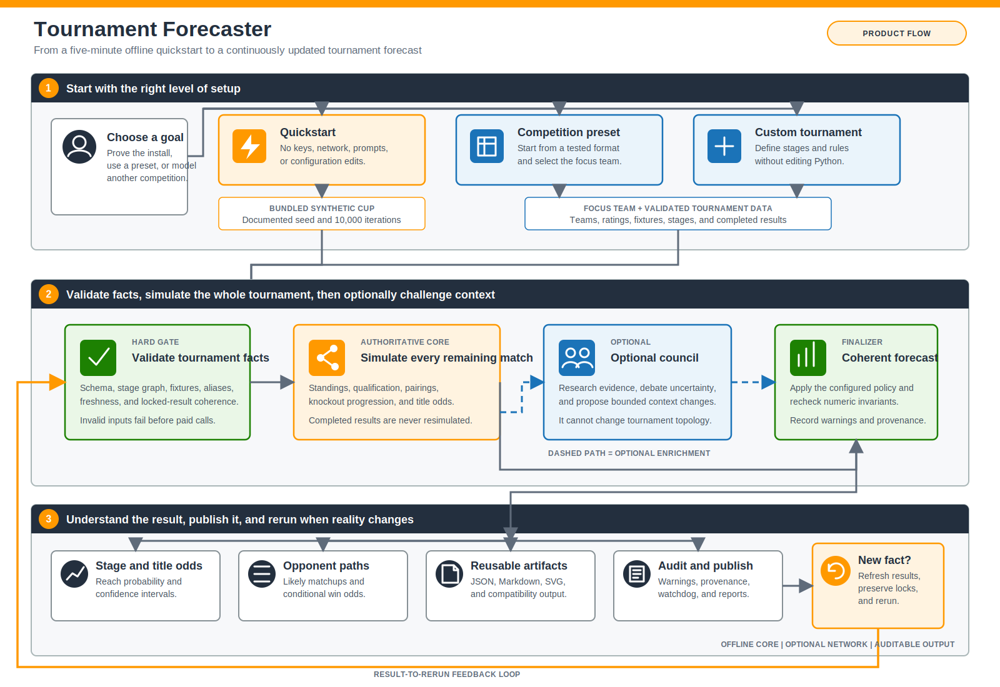

# Product Flow

- **Status:** Target product contract for the open-source migration
- **Product:** Tournament Forecaster

After installation, Tournament Forecaster gives a user two entry paths: an offline quickstart that proves the product works in under five minutes, and an advanced path for forecasting a real competition with optional live data and multi-agent analysis. The first source installation separately requires package-index access for the declared build dependency.

The diagram is also available as a [PNG export](assets/architecture/product-flow.png) for presentations and issue discussions.

## Product Principles

1. **Useful before configuration:** after installation, the first forecast requires no keys, network access, or manual file edits.
2. **One focus team, complete tournament:** the product highlights one team while simulating every match needed to preserve opponent and qualification probabilities.
3. **Facts before forecasts:** completed results are immutable and future probabilities are recalculated around them.
4. **Hybrid intelligence is first-class and optional:** every user gets the deterministic engine; users who enable the council get an auditable two-pass debrief blended at 55% deterministic engine and 45% council consensus.
5. **Every probability is inspectable:** users receive machine-readable results, a human report, a bracket, warnings, provenance, and an audit trail.
6. **The forecast is a loop:** new results and validated inputs produce a new run without rewriting tournament logic.

## Product Surfaces

| Surface | Primary user outcome |
| --- | --- |
| `quickstart` | Prove the installation and generate the first forecast offline |
| `init` and presets | Configure a tournament without writing Python |
| `validate` | Find structural or stale-data problems before simulation or paid calls |
| `update-results` and `update-odds` | Preview and ingest external facts safely |
| `simulate` | Estimate stage reach, matchups, and championship probability |
| optional multi-LLM council | Configure models and effort, debate the deterministic baseline, and apply a bounded 55/45 consensus |
| `report` | Produce reusable JSON, Markdown, SVG, and audit artifacts |
