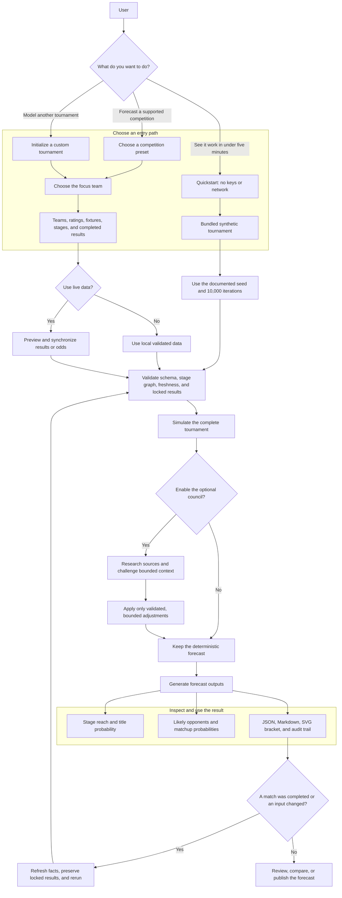

# Product Flow

- **Status:** Target product contract for the open-source migration
- **Product:** Tournament Forecaster

Tournament Forecaster gives a user two entry paths: an offline quickstart that proves the product works in under five minutes, and an advanced path for forecasting a real competition with optional live data and multi-agent analysis.

## Product Principles

1. **Useful before configuration:** the first offline forecast requires no keys, network access, or manual file edits.
2. **One focus team, complete tournament:** the product highlights one team while simulating every match needed to preserve opponent and qualification probabilities.
3. **Facts before forecasts:** completed results are immutable and future probabilities are recalculated around them.
4. **Intelligence is optional:** the deterministic engine is the product; model research and debate are bounded enhancements.
5. **Every probability is inspectable:** users receive machine-readable results, a human report, a bracket, warnings, provenance, and an audit trail.
6. **The forecast is a loop:** new results and validated inputs produce a new run without rewriting tournament logic.

## Product Surfaces

| Surface | Primary user outcome |
| --- | --- |
| `quickstart` | Prove the installation and generate the first forecast offline |
| `init` and presets | Configure a tournament without writing Python |
| `validate` | Find structural or stale-data problems before simulation or paid calls |
| `update-results` and `update-odds` | Preview and ingest external facts safely |
| `simulate` | Estimate stage reach, matchups, and championship probability |
| optional council | Add sourced context and an auditable challenge to the deterministic baseline |
| `report` | Produce reusable JSON, Markdown, SVG, and audit artifacts |
